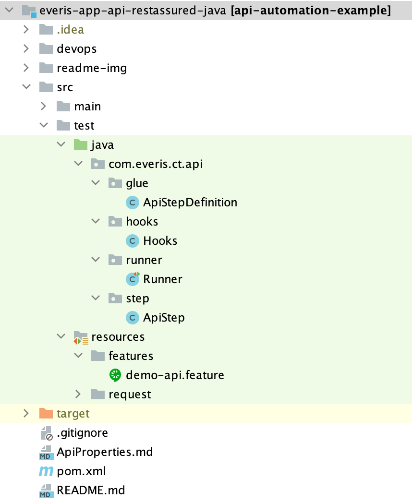

# API AUTOMATION

* Integración entre SpringBoot + RestAssured + Cucumber
* Librería core: RestAssured

## Integración de SpringBoot + Cucumber

Para crear el contexto de ejecución con SpringBoot y reconocimiento de ejcución de Test con Cucumber. Agregar las
siguientes etiquetas sobre la clase 'glue' o 'StepDefinition'

```
@CucumberContextConfiguration
@SpringBootTest
public class ApiStepDefinition {}
```

## Arquetipo del Módulo de Pruebas



## Acceso metodos de ejecucion

Para acceder a estos metodos de ejecución se debe extender de la clase ServiceDom desde la capa **Step.**

* **header():** Interface que accede a los metodos de configuración de cabeceras. Estas cabeceras pueden ser enviadas como:
  - setHeaderConfig(Map<String, String> headersList)
  - setHeaderConfig(DataTable headersDataTable)


* **params():** Interface que accede a los metodos de configuración de parametros (QueryParams, PathVariables). Estos parametros pueden ser enviadas como:
  - setPathParamsConfig(Map<String, Object> params)
  - setPathParamsConfig(DataTable params)
  - setBodyRequestConfig(String jsonFileReqPath, DataTable dataTable)
  - setBodyRequestConfig(String jsonFileReqPath, Map<String, Object> keyValueMap)


* **execute():** Interface que accede a los metodos de ejecución.
  - executeService(ApiConfigBuilder apiConfig) -> Se contruye la configuración con la clase **_ApiConfigBuilder.build()_**
  - executeService(String URI, String method, Headers headers, Map<String, Object> queryParams, Map<String, Object> pathVariables, String bodyRequest)


* **validate():** Interface que accede a los metodos de validacion.
  - validateStatusCode(int statusCode)
  
## Ejecución en Paralelo

Para poder ejecutar test en paralelo, es necesario tomar en cuenta que Cucumber ya se encarga de separa las ejecución en
un hilo independiente siempre y cuando los test se encuentren en diferentes features.

```
- funcionalidad-1.feature
- funcionalidad-2.feature

Si ejecutamos esta prueba con el comando '$mvn verify' cada caso de prueba será ejecutando en un hilo independendiente por feature.
Es decir, dos ejecuciones en paralelo con <n> casos de prueba
```

También, hay que tener la consideración de configurar el plugin 'maven-failsafe-plugin' dentro del pom.xml en la
seccion <build>. En donde vamos a indicar el tipo de paralelismo y hasta el número de hilos para la ejecución.

* Configuración:
  
-parallel= indica el tipo de paralelismo. Para la integració con cucumber se usará 'method', en caso se quiera
  desactivar el paralelismo deberá comentarse esta etiqueta o agregarle el valor 'none' 

-threadCount= indica el numero
  especifico de hilos a ejecutarse. Importante agregar esta etiqueta siempre y cuando exista la etiqueta 'parallel'

-useUnlimitedThreads= También se puede usar esta propiedad si no se quiere especificar un numero concreto de hilos.

```
<plugin>
   <groupId>org.apache.maven.plugins</groupId>
   <artifactId>maven-failsafe-plugin</artifactId>
   <version>2.22.0</version>
      <executions>
         <execution>
             <configuration>
                 <includes>
                   <include>**/*Runner.java</include>
                   <include>**/RunnerTest.java</include>
                 </includes>
                 <parallel>methods</parallel>
                 <!--<useUnlimitedThreads>false</useUnlimitedThreads>-->
                 <threadCount>4</threadCount>
             </configuration>
             <goals>
                <goal>integration-test</goal>
                <goal>verify</goal>
             </goals>
         </execution>
      </executions>
</plugin>
```

## Toma de evidencias

Para capturar la evidencia de ejecución con el Request y Response del servicio ejecutado. Se debe utilizar la siguiente anotacion sobre el metodo de ejecución.
etiqueta: **_@ServiceTracking_**

```
    @ServiceTracking
    public void ejecutarServicio(String serviceConfig) {
        execute().executeService(
                serviceWith().apiURI(ServiceConfig.getURI(serviceConfig))
                        .method(ServiceConfig.getMethod(serviceConfig))
                        .headers(header().getHeaderConfig())
                        .queryParams(params().getQueryParamsConfig())
                        .pathParams(params().getPathParamsConfig())
                        .bodyRequest(params().getBodyRequestConfig())
                        .build()
        );
    }
```

## Redaccion en Gherkin de una configuracion basica

* **Headers**

```
  Given que configuro las cabeceras del servicio
  | HEADER       | VALUE            |
  | Content-Type | application/json |
```

* **Parametros**

```
  And que configuro los pathParams
  | PARAMETER | VALUE |
  | endPoint  | posts |
```

* **Body Request**

```
  And que configuro el bodyRequest: "path/body/request/req.json"
  | JSONPATH | VALUE |
```

La ubicación de los request.json deberan estar en la ruta **_/resources/request/_** para una simple localizacion

* **Ejecucion**

```
 When ejecuto el servicio "GET::https://jsonplaceholder.typicode.com/posts"
```

* **Validacion**

```
 Then valido que el codigo de respuesta sea 200
```

## Configuración de las Opciones de Cucumber

* **@CucumberOptions()** = Soportará las opciones de cucumber
* **plugin = {"json:target/build/cucumber.json"}** = Json que guardar la trazabilidad de ejecución de Cucumber, Posteriormente se usara para la integración con Jira.
* **stepNotifications = true** = Muestra el paso a paso de la ejecución (Opcion cosmetica).
* **publish = true** = Publica un reporte 'público' en el servidor de Cucumber (Este reporte no requiere autorización).
* **features = {"src/test/resources/features"}** = Indica donde están alojados los features.
* **glue = {"com.everis.ct.web.glue"}** = Indica donde está ubicada la definición de los pasos
* **tags = "@REG_GOOGLE"** = Tag indicador de una prueba o un conjunto de pruebas

```
@CucumberOptions(plugin = {"json:target/build/cucumber.json"}, 
        stepNotifications = true,
        publish = true, 
        features = {"src/test/resources/features"}, 
        glue = {"com.everis.ct.web.glue"},
        tags = "@REG_GOOGLE"
)
public class Runner {}
```

## Integración DataSources JDC
La librería tiene como dependencia "spring-boot-starter-jdbc" lo que permite conectarnos a una BD con solo declarar las
propiedades que necesita springBoot para realizar la conexión a BD.

```
spring:
  dataSource:
    driver-class-name: org.postgresql.Driver
    url: jdbc:postgresql://localhost:54322/xxxxx
    username: xxxxx
    password: xxxx
```

También, la librería internamente ya cuenta con el driver de conexión a la BD "postgresql" en runTime, por lo que ya no es
necesario agregar en el pom.xml del proyecto. En caso querramos conectarnos a otro Driver de BD, esta dependencia debería agregarse
en el archivo pom.xml del proyecto.

Para acceder al utilitario con metodos de ayuda para manejar la BD donde nos vamos a conectar, debemos inyectar la siguiente dependencia
en nuestro objecto:

```
 @Autowired
 private JDBCOperations jdbcOperations;
 
 ...
 
 public void method(){
  jdbcOperations.countRow("public.demoTable");
 }
```

**_Métodos utilitarios:_**
Revisar objecto demo: **com.everis.ct.api.db/JDBCOperation.java**

## Generación de reporte HTML Cucumber

Para generar un reporte HTML local de los resultados con cucumber, es necesario agregar el siguiente plugin en la sección </build> del archivo pom.xml

```
<plugin>
     <groupId>net.masterthought</groupId>
     <artifactId>maven-cucumber-reporting</artifactId>
     <version>3.11.0</version>
         <executions>
            <execution>
               <id>cucumber-reports</id>
               <phase>post-integration-test</phase>
               <goals>
                  <goal>generate</goal>
               </goals>
               <configuration>
                  <projectName>CucumberRerpot</projectName>
                  <outputDirectory>${project.build.directory}/site</outputDirectory>
                  <cucumberOutput>${project.build.directory}/build/cucumber.json</cucumberOutput>
               </configuration>
            </execution>
         </executions>
</plugin>
```

Donde, las configuraciones:

* **outputDirectory=** Indica el directorio en donde se generará el reporte HTML de cucumber. En el ejemplo, la ruta especfica el directorio **_Target_** y la carpeta **_/site_**
* **cucumberOutput=** Indica la ruta del archivo output generado posterior a la ejecución. La ruta de este archivo debe coincidir con el especificado en las **_opciones de cucumber_** en la clase Runner.

Por último, realizar la ejecución de un goal  por comandos. Se recomienda utilizar el goal clean para limpiar ejecuciones anteriores.

```
$ mvn clean verify
```

## Integración con Jira y JiraXray

Para integrar las pruebas con el plugin Xray de Jira, utilizar la siguiente configuración:

```
@RunWith(Cucumber.class)
@CucumberOptions(plugin = {"json:target/build/cucumber.json"},
        stepNotifications = true,
        publish = true,
        features = {"src/test/resources/features"},
        glue = {"com.everis.ct.api.glue"},
        tags = "@DEMO"
)
public class Runner {
...
    @AfterClass
    public static void afterExecution() {
        Logger.getLogger(Runner.class.getName()).log(Level.INFO, "AFTER EXECUTION --->");
        JiraXray.importResults();
    }   
```

Configuración de propiedades para Jira

**-jxray.integration**= Activa o desactiva la integración con Jira. Por defecto el valor es 'false'

**-jxray.host**= Host de Jira

**-jxray.client.id**= Credencial generada en la plataforma de Jira. Client Id

**-jxray.client.secret**= Credencial generada en la plataforma de Jira. Secret Id

```
jxray:
  integration: off
  host: "https://xray.cloud.xpand-it.com"
  client:
    id: XXXXX
    secret: XXXXX
```

## Extent Report - PDF y HTML

El FrameWork genera también otro tipo de reportería soportado por la librería **_'extentreports-cucumber6-adapter'_**

Para poder acceder a esta otra alternativa, completar los siguientes pasos.

1. En las opciones de cucumber, en la opción **'plugin'**, agregar el adaptador de la libreria extent _**"com.aventstack.extentreports.cucumber.adapter.ExtentCucumberAdapter:"**_
```
@RunWith(Cucumber.class)
@CucumberOptions(plugin = { "pretty", "json:target/build/cucumber.json",
        "com.aventstack.extentreports.cucumber.adapter.ExtentCucumberAdapter:"
        },
        stepNotifications = true,
        monochrome = true,
        publish = true,
        features = {"src/test/resources/features"},
        glue = {"com.everis.ct.api.glue"},
        tags = "@TAG"
)
```

2. Crear el archivo de propiedades _**"extent.properties"**_ en el directorio de recursos: _**src/test/resources**_ y copiar el siguiente contenido:

* Modificar los datos entre "< >"

```
extent.reporter.spark.start=true
extent.reporter.spark.config=src/test/resources/extent-config.xml
extent.reporter.spark.out=test-output/SparkReport/
screenshot.dir=test-output/
screenshot.rel.path=../
extent.reporter.pdf.start=true
extent.reporter.pdf.out=test-output/PdfReport/<NOMBRE_DEL_REPORTE>.pdf
extent.reporter.spark.base64imagesrc=true
extent.reporter.spark.vieworder=dashboard,test,category,exception,author,device,log
systeminfo.os=<CONTEXTO_SISTEMA_OPERATIVO>
systeminfo.user=<ACTOR_EJECUTOR>
systeminfo.build=<VERSION_BUILD>
systeminfo.AppName=<NOMBRE_DEL_APP>
```

3. Crear el archivo xml _**"extent-config.xml"**_ en el directorio de recursos: _**src/test/resources**_ y copiar el siguiente contenido:

```
<?xml version="1.0" encoding="UTF-8"?>
<extentreports>
    <configuration>
        <!-- report theme -->

        <!-- standard, dark -->

        <theme>dark</theme>
        <!-- document encoding -->

        <!-- defaults to UTF-8 -->

        <encoding>UTF-8</encoding>
        <!-- protocol for script and stylesheets -->

        <!-- defaults to https -->

        <protocol>http</protocol>
        <!-- title of the document -->
        <documentTitle>Extent</documentTitle>
        <!-- report name - displayed at top-nav -->

        <reportName>Grasshopper Report</reportName>
        <!-- location of charts in the test view -->

        <!-- top, bottom -->

        <testViewChartLocation>bottom</testViewChartLocation>
        <!-- custom javascript -->

        <scripts>

            <![CDATA[
$(document).ready(function() {
});
]]>
        </scripts>
        <!-- custom styles -->
        <styles>
            <![CDATA[
]]>
        </styles>
    </configuration>
</extentreports>
```

4. Ejecutar la prueba desde la clase Runner o por comandos. Al finalizar se creara una carpeta en el root del proyecto con los reportes en formato PDF y HTML.

## Recomendaciones

### Para enviar la configuracion de la URI y el metodo de ejecucion

Se recomienda utilizar el siguiente formato:

```
* <METODO_HTTP>::<URI>

GET::https://jsonplaceholder.typicode.com/{endPoint}
```

Para obtener el primer y segundo valor, puede utilizarse los metodos:
* ServiceConfig.getMethod(String service)
* ServiceConfig.getURI(String service)

Para construir una configuración comletar del servicio se recomienda utilizar el metodo: **_serviceWith()_**

```
serviceWith()
      .apiURI(ServiceConfig.getURI(serviceConfig))
      .method(ServiceConfig.getMethod(serviceConfig))
      .headers(header().getHeaderConfig())
      .queryParams(params().getQueryParamsConfig())
      .pathParams(params().getPathParamsConfig())
      .bodyRequest(params().getBodyRequestConfig())
  .build()
```